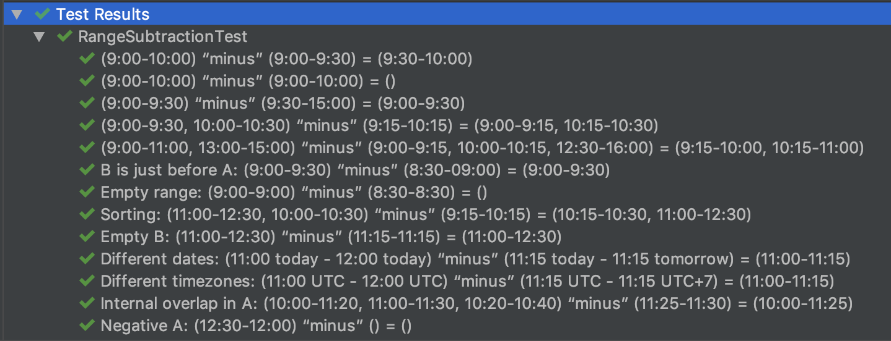

# Time Ranges Subtraction

## Coding problem
Write a program that will subtract one list of time ranges from another. Formally: for two lists of time ranges A and B, a time is in (A-B) if and only if it is part of A and not part of B.

A time range has a start time and an end time. You can define times and time ranges however you want (Unix timestamps, date/time objects in your preferred language, the actual string “start-end”, etc).

Your solution shouldn’t rely on the granularity of the timestamps (so don’t, for example, iterate over all the times in all the ranges and check to see if that time is “in”).

## Algorithm phases:
1. Sorting of A and B
2. Merging of overlapping ranges withing A and B
3. Filtering of empty and negative ranges withing A and B
4. Subtraction (A-B)

## Assumptions and limitations:
1. The regular timeline is assumed over "Groundhog Day" one (time is not going in a circle within the same date after midnight). Therefore date **and** time should be provided on the input for time ranges. 
2. Input may or may not be sorted. Subtraction algorithm itself has linear complexity but requires pre-sorting. Therefore overall complexity is O(nlogn). 
3. Input may or may not contain overlapping ranges (e.g. A = {09:30-09:45, 09:15-10:00}). Such ranges are merged.
4. Input may or may not contain empty ranges (e.g., from 09:30 till 09:30 of the same day). Such ranges are filtered.
5. Input may or may not contain negative ranges (e.g, from 12:00 till 11:00 of the same day). Such ranges are filtered. 

## How to build and run

You need JDK 11 installed to build the code. 

### Local build with JDK

Run `./gradlew build` to build the uber-jar

Run `java -jar -Dserver.port=8080 build/libs/time-ranges-subtractor-0.0.1-SNAPSHOT.jar` to start the application. 

Open `http://localhost:8080/swagger-ui.html`

You can change the port option (e.g. `-Dserver.port=8081` will make an app accessible for you on port 8081)

### Local build with Docker

Run `./gradlew build docker` to build the image

Run `docker run -p 8080:8080 -t dgladyshev/time-ranges-subtractor`

Open `http://localhost:8080/swagger-ui.html`

You can change the port option (e.g. `8081:8080` will make an app accessible for you on port 8081)

## How to run without build

### Pre-existing Docker image

You can skip the build part and use the latest image I've pushed to the Docker Hub

Simply run `docker run -p 8080:8080 -t dgladyshev/time-ranges-subtractor` and it will pull and run the image for you.

## How to test 

### Swagger UI

Once the application is running you can send POST requests to http://localhost:8080/subtract endpoint (port might be different if you changed it) with the payload as such: 

``` js
{
  "a": [
    {
      "start": "2019-02-11T10:00:00.000Z",
      "end": "2019-02-11T10:15:00.000Z"
    }
  ],
  "b": [
    {
      "start": "2019-02-11T10:10:00.000Z",
      "end": "2019-02-11T10:20:00.000Z"
    },
    {
      "start": "2019-02-11T12:00:00Z",
      "end": "2019-02-11T12:20:00Z"
    }
  ]
}
```

Note that the dates should be submitted in ISO-8601 format and that only "yyyy-mm-ddThh:mm:ss[.mmm]Z" is supported (UTC time). 

### cURL

You can send HTTP request directly using cURL, example

```
curl -X POST "http://localhost:8080/subtract" -H "accept: */*" -H "Content-Type: application/json" -d "{ \"a\": [ { \"start\": \"2019-02-11T10:00:00.000Z\", \"end\": \"2019-02-11T10:15:00.000Z\" } ], \"b\": [ { \"start\": \"2019-02-11T10:10:00.000Z\", \"end\": \"2019-02-11T10:20:00.000Z\" } ]}"
```

### Unit Tests

Following test cases were implemented: 



To run those test cases automatically execute `./gradlew test`

And then open `build/reports/tests/test/index.html` in any browser to see the report.